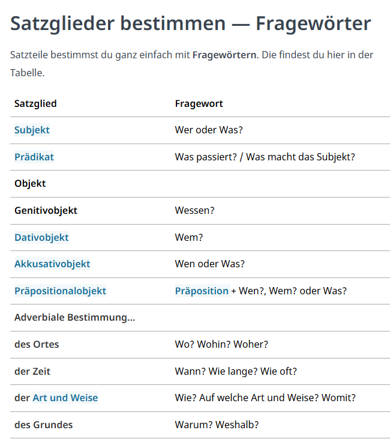

# Thema: Satzbau
## Handouts
### Satzglieder(=Satzteile)
#### Subjekt und Prädikat bestimmen

#### Subjekt und Prädikat bestimmen

- Wessen? (Genitivobjekt)
- Wem? (Dativobjekt)
- Wen? oder Was? (Akkusativobjekt)
- Präposition + Wen?, Wem? oder Was? (Präpositionalobjekt)
- https://studyflix.de/deutsch/satzglieder-bestimmen-3797

#### Adverbiale Bestimmung erkennen

## Neu Wörter
- notwending - necessary, bisher - so far/until now,  gründlich - thoroughly
## Hausaufgaben
## Zusätzliche Selbslesen
- [Satzbau Lingolia](https://deutsch.lingolia.com/de/grammatik/satzbau)
- [Satzbau](https://mein-deutschbuch.de/files/grammatik/saetze/satzlehre.pdf)
- [Satzglieder bestimmen](https://studyflix.de/deutsch/satzglieder-bestimmen-3797)
[Züruck](../README.md)