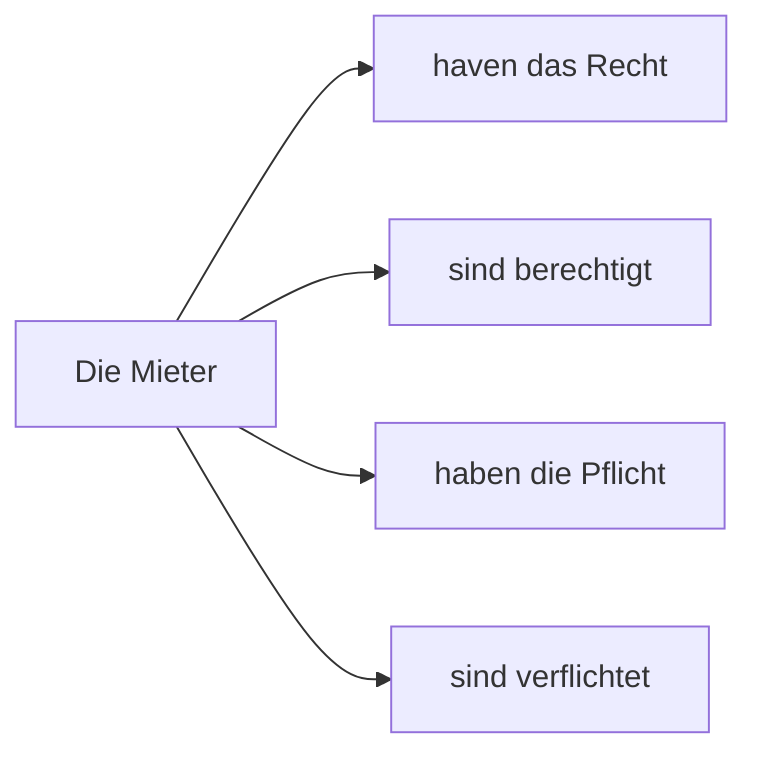

# Thema: Satzglieder + Rechte und Plfichten
## Handouts
### Rechte und Pflichten
- das Rect - was man tun darf
- die Pflicht - was man tun muss
### Rechte und Pflichten

## Neu Wörter
- betreten - enter, zutritt - access  

[Züruck](../README.md)