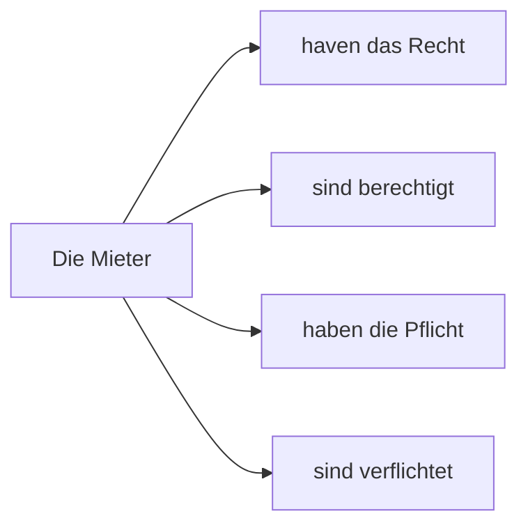

# Thema: Satzglieder + Rechte und Plfichten
## Handouts
### Rechte und Pflichten
- das Rect - was man tun darf
- die Pflicht - was man tun muss
### Rechte und Pflichten

## Neu Wörter
- betreten - enter, zutritt - access
## Hausaufgaben
## Zusätzliche Selbslesen
- [Satzbau Lingolia](https://deutsch.lingolia.com/de/grammatik/satzbau)
- [Satzbau](https://mein-deutschbuch.de/files/grammatik/saetze/satzlehre.pdf)
- [Satzglieder bestimmen](https://studyflix.de/deutsch/satzglieder-bestimmen-3797)  

[Züruck](../README.md)